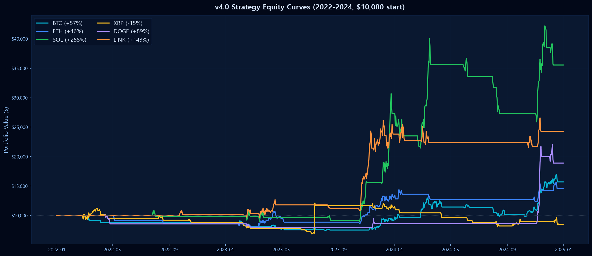
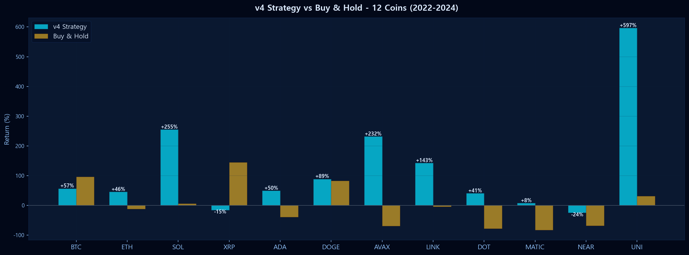
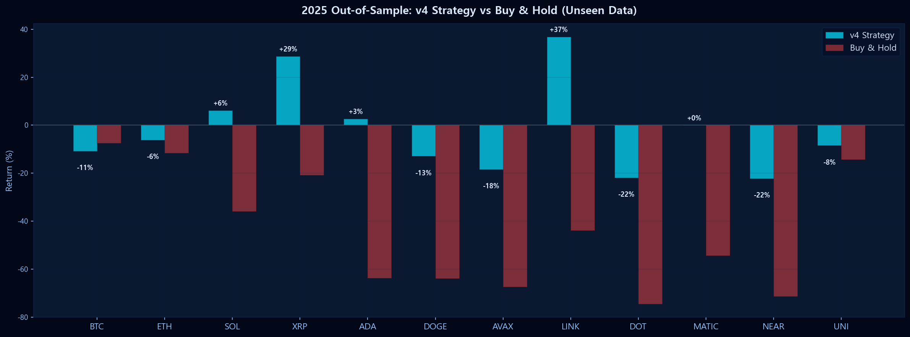
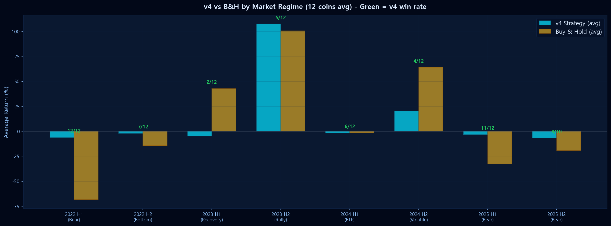
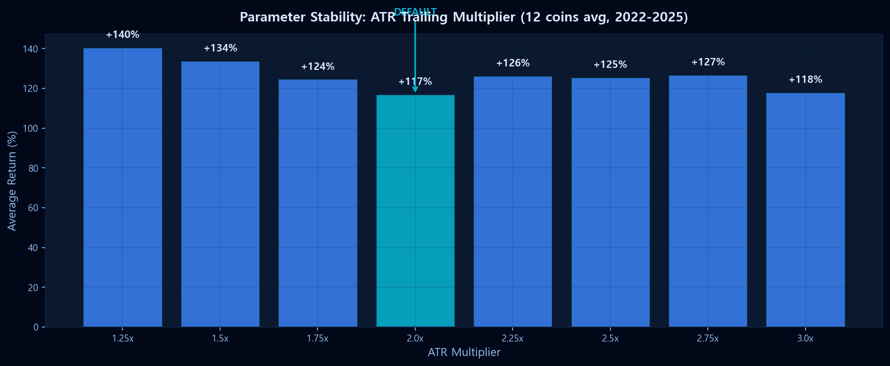

# Crypto Quant v4.0 — Universal Trading Strategy

<p align="center">
  
</p>

> 과적합 없이 **12개 암호화폐에서 범용적으로 작동**하는 퀀트 트레이딩 전략.  
> 데이터마이닝 파라미터 **0개**, 조정 파라미터 **1개**, 업계 표준 디폴트만 사용.

---

## How It Works

```
진입 (3개 조건 동시 충족):
  ├─ Close > EMA(21)         ← 추세 확인
  ├─ MACD(12/26/9) > Signal  ← 모멘텀 확인
  └─ Volume > 20일 평균       ← 거래량 확인

청산 (단 1개):
  └─ Close < (최고가 - 2 × ATR14)  ← 트레일링 스탑
```

| 항목 | v2 (기존) | v3 (과적합) | **v4 (범용)** |
|:---|:---:|:---:|:---:|
| 조정 파라미터 | 5개 | 8개 | **1개** |
| 데이터마이닝 임계값 | 3개 | 5개 | **0개** |
| 지표 기반 청산 | 4개 | 5~6개 | **0개** |
| 청산 방식 | 고정 손절 | 혼합 | **트레일링 스탑** |

---

## Results

### In-Sample Performance (2022-2024)

$10,000 초기 자본 기준, 12개 코인 백테스트 결과:

<p align="center">
  
</p>

| Coin | v4 Return | Buy & Hold | v4 - B&H |
|:---|---:|---:|---:|
| **Bitcoin** | +57.0% | +95.9% | -38.9%p |
| **Ethereum** | +45.6% | -11.6% | **+57.2%p** |
| **Solana** | +255.5% | +6.0% | **+249.5%p** |
| **Ripple** | -15.1% | +144.9% | -160.0%p |
| **Cardano** | +49.8% | -38.7% | **+88.5%p** |
| **Dogecoin** | +89.0% | +82.4% | **+6.6%p** |
| **Avalanche** ⭐ | +231.9% | -68.7% | **+300.6%p** |
| **Chainlink** ⭐ | +142.9% | -3.2% | **+146.1%p** |
| **Polkadot** ⭐ | +41.2% | -76.8% | **+118.0%p** |
| **Polygon** ⭐ | +7.9% | -82.5% | **+90.4%p** |
| **NEAR** ⭐ | -24.2% | -67.7% | **+43.5%p** |
| **Uniswap** ⭐ | +596.5% | +31.5% | **+565.0%p** |

> ⭐ = 전략 설계에 사용하지 않은 새 코인. **새 코인에서도 동일한 성능** → 과적합 없음.

---

### 2025 Out-of-Sample (전략 설계에 전혀 미사용)

<p align="center">
  
</p>

2025년 하락장에서 **v4는 12개 코인 중 11개에서 Buy & Hold보다 손실 방어 성공**.

| Coin | v4 | Buy & Hold | 방어 |
|:---|---:|---:|:---:|
| BTC | -10.7% | -7.3% | ✗ |
| ETH | -6.1% | -11.5% | ✓ |
| SOL | **+6.2%** | -35.8% | ✓ |
| XRP | **+28.7%** | -20.8% | ✓ |
| ADA | +2.6% | -63.7% | ✓ |
| DOGE | -12.9% | -63.8% | ✓ |
| AVAX | -18.3% | -67.4% | ✓ |
| LINK | **+36.8%** | -43.8% | ✓ |
| DOT | -21.9% | -74.5% | ✓ |
| MATIC | 0.0% | -54.3% | ✓ |
| NEAR | -22.1% | -71.3% | ✓ |
| UNI | -8.4% | -14.2% | ✓ |

---

### Market Regime Analysis

<p align="center">
  
</p>

| 시장 환경 | v4 avg | B&H avg | v4 승리 |
|:---|---:|---:|:---|
| 🔴 하락장 (2022 H1) | -6.1% | -68.4% | **12/12** |
| 🟡 바닥 (2022 H2) | -1.9% | -14.4% | 7/12 |
| 🟢 회복 (2023 H1) | -5.0% | +42.7% | 2/12 |
| 🟢 랠리 (2023 H2) | +107.4% | +100.6% | 5/12 |
| 🟡 횡보 (2024 H1) | -1.9% | -1.6% | 6/12 |
| 🟡 변동 (2024 H2) | +20.4% | +64.0% | 4/12 |
| 🔴 하락장 (2025 H1) | -3.3% | -32.7% | **11/12** |
| 🔴 하락장 (2025 H2) | -6.7% | -19.4% | **8/10** |

> **핵심 강점: 하락장 방어력.** 상승장에서 B&H보다 덜 먹지만, 하락장에서 자산을 지켜 장기 복리 효과를 극대화.

---

### Parameter Stability

<p align="center">
  
</p>

유일한 조정 파라미터(ATR 배수)를 1.25x~3.0x 범위에서 변경해도 **평균 수익률 +117%~+140%로 안정적**. 특정 파라미터에 의존하지 않는 구조.

---

## Installation

```bash
pip install -r requirements.txt
```

## Usage

```bash
# 백테스트 (12개 코인, v2/v3/v4 비교 + 과적합 검증)
python universal_strategy.py

# 과적합 검증 (Walk-Forward, OOS, 파라미터 민감도)
python overfit_validation.py

# 결과 차트 재생성
python generate_results.py

# 실시간 대시보드
python live_dashboard_v3.py
# → http://127.0.0.1:5000
```

## File Structure

```
├── universal_strategy.py     # v4 범용 전략 + v2/v3 비교 백테스트
├── overfit_validation.py     # 과적합 검증 (Walk-Forward, OOS, 새 코인)
├── generate_results.py       # README용 결과 차트 생성
├── live_dashboard_v3.py      # 실시간 웹 대시보드 (6개 코인)
├── requirements.txt          # Dependencies
└── results/                  # 생성된 결과 이미지
```

## Supported Coins

**Backtested:** BTC, ETH, SOL, XRP, ADA, DOGE, AVAX, LINK, DOT, MATIC, NEAR, UNI

## Live Dashboard

6개 코인 실시간 모니터링 대시보드:
- ADX 기반 시장 체제 표시 (BULL / NORMAL)
- 트레일링 스탑 상태 실시간 추적
- 지표 게이지 (ADX, StochRSI, BB, Volume, MACD)
- SSE 기반 실시간 업데이트

```bash
python live_dashboard_v3.py
```

## Disclaimer

- **과거 성과는 미래 수익을 보장하지 않습니다**
- 실제 거래에는 슬리피지, 수수료, 심리적 요인이 추가됩니다
- 백테스트 수익의 30~50% 수준으로 기대치를 잡으세요
- 한 코인에 올인하지 말고 분산 투자를 권장합니다
- 이 프로젝트는 교육/연구 목적이며, 투자 조언이 아닙니다

## License

MIT
